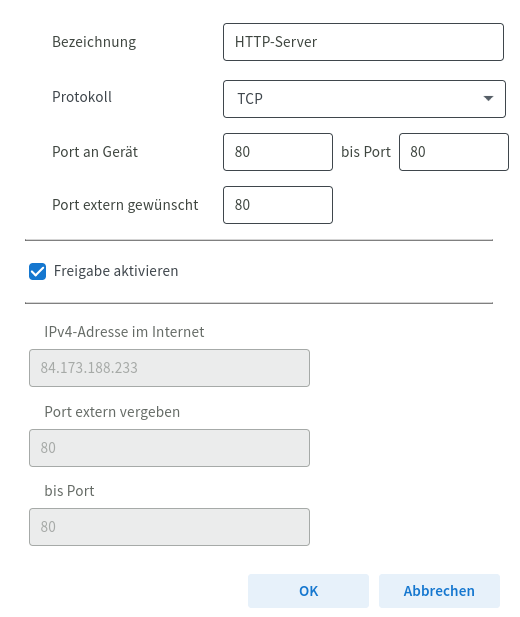
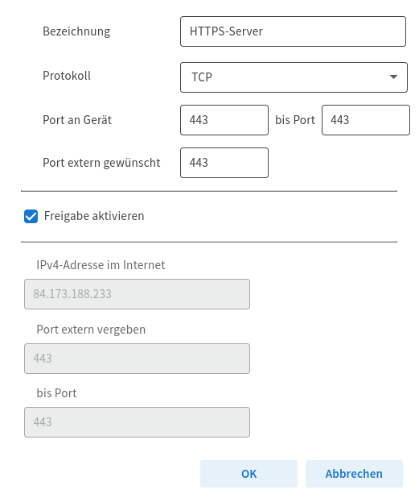
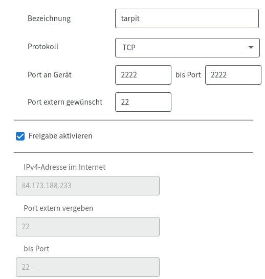

# NixOS Configurations

This project provides a set of preconfigured modules for NixOS, aimed at setting up various environments such as gaming, workspace, server remote desktop, and general server setups. The goal is to simplify and automate the configuration of NixOS systems.

## Features

- **Gaming Setup**: Install and configure gaming-related software and settings.
- **Workspace Setup**: Prepare a productive workspace environment.
- **Server Remote Desktop**: Configure a server for remote desktop access.
- **General Server Setup**: Set up a basic server configuration.
- **Modular Design**: Easily extendable to include more modules as needed.

## Prerequisites

Before running the build script, the script will check and install the necessary programs on your system if they are not already installed. These include:

- `fzf`
- `mkpasswd`
- `pciutils`
- Any other dependencies listed in the respective module files

## Installation

To install and use these configurations, follow these steps:

1. Clone the repository:

    ```sh
    git clone https://github.com/fr4iser90/NixOs.git
    cd NixOs
    ```

2. Make the main build script executable:

    ```sh
    chmod +x build.sh
    ```

3. Run the build script to install the desired configuration modules:

    ```sh
    bash ./build.sh
    ```

The `build.sh` script will guide you through a menu where you can select and install the predefined modules you need for your NixOS configuration.

## Usage

# Project Setup Instructions

## Gaming Setup
<details>
  <summary>Click to expand</summary>
  
  File: `/etc/nixos/modules/packages/setup/gaming.nix`

  Includes:
  - `lsof`
  - `git`
  - `wget`
  - `tree`
  - `firefox`
  - `vlc`
  - `fish`
  - `alacritty`
  - `lutris`
  - `wine`
  - `winetricks`
  - `wineWowPackages.full`
  - `discord`
  - `bitwarden-cli`
  - `owncloud-client`
  - `plex`
  - `ffmpeg`
  
</details>

## Multimedia Setup
<details>
  <summary>Click to expand</summary>
  
  File: `/etc/nixos/modules/packages/setup/multimedia.nix`

  Includes:
  - `lsof`
  - `git`
  - `wget`
  - `tree`
  - `firefox`
  - `vlc`
  - `fish`
  - `alacritty`
  - `plex`
  - `kodi`
  - `rhythmbox`
  - `clementine`
  - `spotify`
  
</details>

## General Server Setup
<details>
  <summary>Click to expand</summary>
  
  Docker:
  - `ReverseProxy = traefik`
  - `security = crowdsec`
  - `DockerManagement = portainer`
  - `passwordManager = bitwarden`
  - `honeypot = tarpit`
  - `VPN = wireguard`
  - `URLManagement = YOURLS`
  - `Cloud = owncloud`
  - `dashboard = organizr`
  - `mediaServer = plex`
  - `adblocker = pihole`
  - `dockerUpdater = watchtower`
  
  File: `/etc/nixos/modules/packages/setup/server.nix`

  Includes:
  - `lsof`
  - `git`
  - `wget`
  - `tree`
  - `konsole`
  - `htop`
  - `tmux`
  - `screen`
  - `nmap`
  - `ncdu`
  - `iperf3`
  - `ethtool`
  - `openssh`
  - `fail2ban`
  - `iptables`
  - `tcpdump`
  - `rsync`
  - `curl`
  - `nginx`
  - `mariadb`
  - `redis`
  - `memcached`
  - `php`
  - `python3`
  - `nodejs`
  - `docker`
  - `podman`
  - `kubernetes`
  - `virt-manager`
  - `qemu`
  - `rsnapshot`
  - `borgbackup`
  
</details>


## Server Remote Desktop Setup
<details>
  <summary>Click to expand</summary>
  
  File: `/etc/nixos/modules/packages/setup/serverRemoteDesktop.nix`

  Includes:
  - `lsof`
  - `git`
  - `wget`
  - `tree`
  - `konsole`
  - `htop`
  - `tmux`
  - `screen`
  - `nettools`
  - `nmap`
  - `ncdu`
  - `iperf3`
  - `ethtool`
  - `openssh`
  - `fail2ban`
  - `iptables`
  - `tcpdump`
  - `rsync`
  - `curl`
  - `firefox`
  - `vlc`
  - `weston`
  - `x11vnc`
  - ...
  
</details>

## Workspace Setup
<details>
  <summary>Click to expand</summary>
  
  File: `/etc/nixos/modules/packages/setup/workspace.nix`

  Includes:
  - `discord`
  - `lsof`
  - `git`
  - `wget`
  - `tree`
  - `firefox`
  - `vlc`
  - `fish`
  - `alacritty`
  - `vscode`
  - `clion`
  - `qtcreator`
  - `geany`
  - `eclipse`
  - `monodevelop`
  - `android-studio`
  - `kate`
  - `emacs`
  - `vim`
  - `neovim`
  - `docker`
  - `kubectl`
  - `terraform`
  - `ansible`
  - `vagrant`
  - `heroku`
  - `awscli`
  - `gdb`
  - `cmake`
  - `bazel`
  - `maven`
  - `gradle`
  - `nodejs`
  - `yarn`
  - `kitty`
  - `python3`
  - `jellyfin-media-player`
  - `owncloud-client`
  - `ruby`
  - `go`
  - `rustup`
  - `php`
  - `perl`
  - `elixir`
  - `racket`
  - `julia`
  - `sbcl`
  - `lua`
  - `plex`
  - `slack`
  - `zoom-us`
  - `mattermost-desktop`
  - `telegram-desktop`
  - `signal-desktop`
  - `thunderbird`
  - `remmina`
  
</details>


## Docker Server Setup Tutorial

This tutorial will guide you through setting up a server using Docker, and configuring it for security.
### Step 1: Run the Build Script and Reboot

First, run the build script as mentioned in the installation section and then reboot your system.

sh

bash ./build.sh

Follow the commands from the script
After building, check the environment configuration
sudo reboot

###  Step 2: Log in and Set Password for guestuser

After rebooting, log in to your system and set a password for the guestuser (replace guestuser with your Docker user if different).

sh

sudo passwd guestuser

### Step 3: Start Docker Installation Script

Log in as guestuser and run the Docker installation script.

sh

su - guestuser
bash start.sh
Follow the bashline

###  Step 4: Configure Security

The script will guide you through setting up a security bouncer, passwords, and usernames. Follow the prompts to complete the setup.
###  Step 5: Verify Docker Setup

Check that Docker is installed and running correctly.

## License

This project is licensed under the MIT License. See the [LICENSE](./LICENSE) file for details.

## Contact

If you have any questions or issues, feel free to open an issue on GitHub or contact the repository owner.

## Screenshots/Demo

### Open Ports on Your Router

**HTTP:**



**HTTPS:**



**Honeypot Tarpit (needs to be redirected to port 2222):**



---

⭐️ **Happy Nixing!** ⭐️
